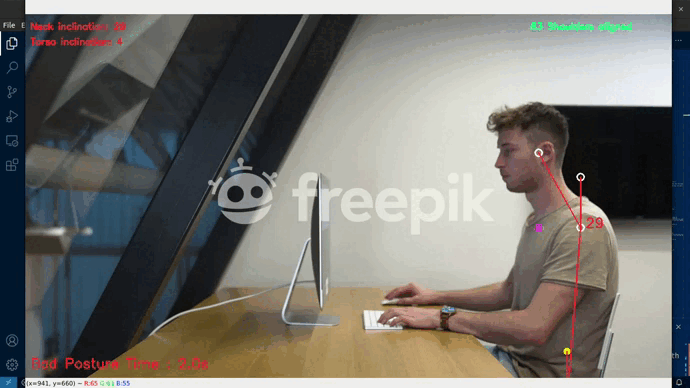

# Posture Monitor with MediaPipe 👤💻



## Overview
This project utilizes the MediaPipe library to create a real-time posture monitoring system using a webcam or video. The application assesses the alignment of the shoulders and the inclination of the neck and torso to determine whether the user is maintaining a good or bad posture. Additionally, it calculates the time spent in each posture and alerts the user if they remain in a bad posture for an extended period 🕒⚠️. 

This code was created with the help of the article [**Building a Poor Body Posture Detection & Alert System Using MediaPipe Body Tracking**](https://learnopencv.com/building-a-body-posture-analysis-system-using-mediapipe/).


## Requirements
* Python 3.x
* OpenCV (`pip install opencv-python`)
* NumPy (`pip install numpy`)
* Mediapipe (`pip install mediapipe`)

## Usage
1. Clone the repository to your local machine:
``` bash
git clone https://github.com/mecantronic/posture-monitor
```

2. Navigate to the project directory:
``` bash
cd posture-monitor
```

3. Create and activate a virtual environment:
``` bash
python -m venv venv
```
* On Windows:
    ``` bash
    venv\Scripts\activate
    ```
* On macOS and Linux:
    ``` bash
    source venv/bin/activate
    ```

4. Install the required dependencies:
``` bash
pip install -r requirements.txt
```

5. Run the posture monitoring script:
``` bash
python app.py --video 'path/to/your/video.mp4' --offset-threshold 100 --neck-angle-threshold 25 --torso-angle-threshold 10 --time-threshold 180
```
* Optionally, you can omit --video to use the default webcam.

6. Adjust your webcam to capture your posture, and the application will display real-time feedback on your posture status, inclination angles, and time spent in each posture. 📹👀

## Features
* Real-time posture monitoring using the webcam. 🔄
* Visualization of shoulder alignment and neck/torso inclination angles. 📏🔄
* Dynamic feedback on posture status (good or bad). 👍👎
* Calculation of time spent in each posture. 🕒
* Alert mechanism if bad posture is maintained for an extended period. ⚠️

## Configuration
You can adjust the following parameters in the posture_monitor.py script:

* **Video** (`--video`): Path of video file.
* **Offset Threshold** (`--offset-threshold`): Threshold value for shoulder alignment. 📏
* **Angle Thresholds** (`--neck-angle-threshold`, `--torso-angle-threshold`): Threshold values for neck and torso inclination angles. 📐
* **Time Threshold** (`--time-threshold`): Time threshold for triggering a posture alert. 🕒

## Acknowledgments
This project utilizes the [MediaPipe](https://mediapipe.dev/) library for pose estimation. 👏

## License
This project is licensed under the [MIT License](https://opensource.org/license/mit/). 📜

Feel free to contribute or report issues! 🚀
